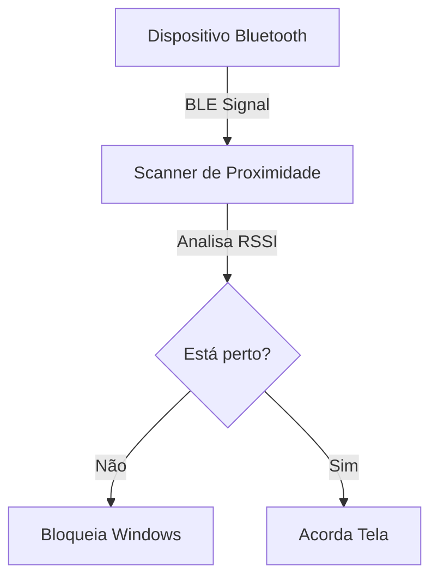

# 🔐 Proximity Lock PC

<p align="center">
  
  
  
</p>

O **Proximity Lock PC** é uma solução leve e eficiente para aumentar a segurança do seu computador. Ele bloqueia automaticamente o Windows quando você se afasta e ativa a tela assim que você retorna, utilizando a intensidade de sinal (RSSI) de dispositivos Bluetooth próximos.

---

## ✨ Funcionalidades

*   **🔒 Bloqueio Automático:** Tranca o PC instantaneamente ao detectar que seu dispositivo Bluetooth está fora de alcance ou com sinal muito fraco.
*   **🔆 Wake-on-Proximity:** Ativa a tela automaticamente assim que você se aproxima (economizando tempo).
*   **🔹 Ícone na Bandeja:** Interface discreta na bandeja do sistema para monitoramento em tempo real.
*   **⚙️ Altamente Configurável:** Ajuste a sensibilidade e os intervalos conforme sua necessidade.

> [!IMPORTANT]
> **Segurança em primeiro lugar:** Este projeto **não armazena senhas** e **não realiza login automático**. Ele apenas solicita que o Windows bloqueie a sessão e desperte a tela. Você ainda precisará digitar sua senha/PIN manualmente.

---

## 🛠️ Como Funciona o Fluxo



---

## 📁 Estrutura do Projeto

```text
proximity-lock-pc/
├── config/           # Configurações do usuário
│   └── settings.json
├── scripts/          # Ferramentas auxiliares
│   ├── scan_details.py
│   └── install_startup.ps1
├── src/              # Código fonte
│   ├── bluetooth/    # Scanner BLE
│   ├── core/         # Lógica de monitoramento
│   ├── system/       # Integração com Windows OS
│   └── main.py       # Ponto de entrada
├── requirements.txt  # Dependências
└── README.md
```

---

## 🚀 Guia de Instalação

### 1. Preparar Ambiente
Certifique-se de ter o Python 3.10 ou superior instalado.

```bash
# Clone o repositório ou baixe os arquivos
# Crie o ambiente virtual
py -m venv venv

# Ative o ambiente
.\venv\Scripts\activate

# Instale as dependências
pip install -r requirements.txt
```

### 2. Localizar seu Dispositivo
Mantenha o dispositivo que você deseja usar (celular, relógio) bem próximo ao computador e execute:

```bash
python scripts/scan_details.py
```

**Copie o `service_uuid`** (recomendado) ou o endereço MAC que aparecer no log para o seu dispositivo.

---

## ⚙️ Configuração

Crie ou edite o arquivo `config/settings.json`:

```json
{
    "phone_mac": "",
    "service_uuid": "SEU_UUID_AQUI",
    "scan_interval": 5,
    "max_misses": 2,
    "rssi_threshold": -85
}
```

### Parâmetros de Ajuste

| Parâmetro | Descrição | Sugestão |
| :--- | :--- | :--- |
| `service_uuid` | UUID do serviço BLE do seu dispositivo. | **Recomendado** para Android/iOS. |
| `phone_mac` | Endereço MAC (use se o UUID não estiver disponível). | Deixe `""` se usar UUID. |
| `scan_interval` | Segundos entre cada verificação de sinal. | `5` (Equilíbrio bateria/segurança) |
| `max_misses` | Tolerância de falhas antes de bloquear. | `2` ou `3` (Evita bloqueios falsos) |
| `rssi_threshold`| Limite de sinal (dBm). | `-80` (muito perto) a `-95` (longe) |

> **Dica:** O RSSI é um valor negativo. Quanto mais próximo de **0**, mais forte o sinal. Se o PC bloquear enquanto você ainda está sentado, diminua o valor (ex: mude de -80 para -90).

---

## 💻 Uso e Execução

### Modo Manual
Para testar e ver os logs em tempo real:
```bash
python src/main.py
```

### Inicialização Automática
Para que o programa inicie sozinho sempre que você ligar o PC (sem janelas abertas):
1. Abra o PowerShell como Administrador.
2. Execute o script de instalação:
```powershell
.\scripts\install_startup.ps1
```

---

## ⚠️ Limitações
*   **RSSI Inconstante:** Paredes, móveis e até o seu corpo podem interferir no sinal Bluetooth.
*   **Deep Sleep:** Alguns sistemas Windows desativam o Bluetooth em modo de economia de energia agressivo, o que pode impedir o despertar da tela.

---

## 🛡️ Tecnologias Utilizadas
*   [Bleak](https://github.com/hbldh/bleak) - Scanner Bluetooth Low Energy.
*   [Pystray](https://github.com/moses-palmer/pystray) - Ícone de bandeja do sistema.
*   [PyWin32](https://github.com/mhammond/pywin32) - APIs nativas do Windows.

---
<p align="center">Feito com ❤️ para uma mesa de trabalho mais segura.</p>
  <sub>Projeto desenvolvido por <b>Pedro Augusto Da Costa</b></sub>
  <sub>Linkedin: https://www.linkedin.com/in/pedro-augusto-da-costa-02347831a?utm_source=share&utm_campaign=share_via&utm_content=profile&utm_medium=android_app</sub>
</div>
